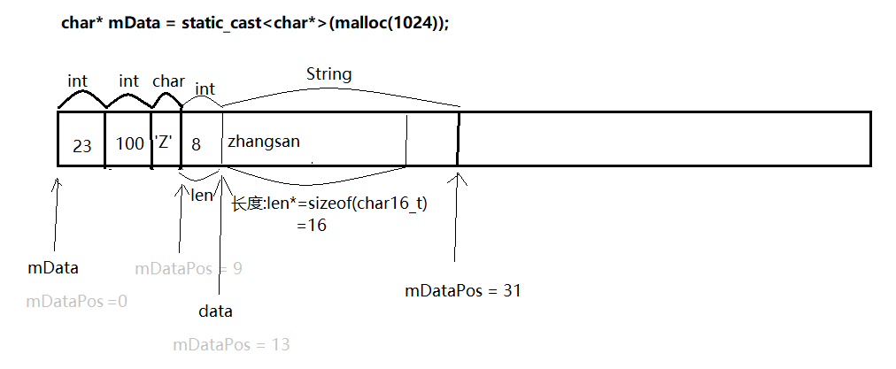

# MyParcel

实现系统Parcel类的int、char、String类型数据的存取的核心流程，便于了解Parcel。

如上图：首先存入的是两个int类型的数据23和100，然后在存入的是char类型的数据'Z'，最后存入的是String类型的数据，这里重点说一下String是怎么存入的。

存入String类型的数据，首先先把String类型的数据的长度以int类型存入String类型的数据的开始位置，然后接下来在存入String字符串。